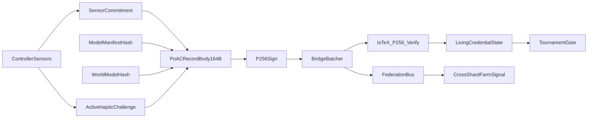

# VAPI: Verifiable Human Input Provenance for Gaming (HPIP)
## A cryptographic evidence rail with physics-backed liveness and active haptic challenge-response

**Draft:** V3 (novel framing rewrite)  
**Status:** Review-only. Does not replace `docs/vapi-whitepaper-v2.md`.  

---

## Abstract

Competitive gaming has no public, cryptographically verifiable way to distinguish **human physical controller input** from bot/script activity that injects a convincing input stream. We present **VAPI**, a system that provides a *verifiable provenance rail* for controller sessions: a fixed-size, hash-chained, ECDSA-P256 signed evidence stream that any third party can verify on-chain for **origin, ordering, and integrity** under explicit key-custody assumptions. VAPI then makes **software-only forgery empirically infeasible** by binding provenance to physics-coupled signals (IMU, trigger dynamics, stick-IMU coupling) and optionally to an **active haptic challenge-response** that perturbs the controller (adaptive trigger resistance) and measures a biomechanical response that software injection cannot produce because it cannot feel the applied resistance.

VAPI’s goal is not a purely cryptographic proof of “human” in isolation. Rather, it composes cryptographic provenance with measurable physical constraints to enable **high-trust ranked matchmaking pools**, **remote tournament qualification**, **streamer and creator verification**, and **dispute-resilient session forensics** for all gamer segments, while making privacy and governance trade-offs explicit.

---

## 1. Motivation: impact for all gamers (not just esports)

VAPI is designed so its benefits scale down to everyday play, not only prize tournaments.

- **Casual players**: optional “trusted queue” pools without invasive kernel anti-cheat; fewer obvious bot lobbies.
- **Ranked competitors**: eligibility based on an ongoing evidence stream, not one-time device checks; fewer ladder distortions.
- **Esports & remote qualifiers**: cryptographically auditable evidence for “this run was performed on certified hardware by a physically present human under stated assumptions.”
- **Creators/streamers**: a “verified human gameplay” badge for VODs/highlights, enabling trust without platform-specific integrations.
- **Accessibility & fairness**: VAPI must treat motor disabilities, atypical play, and assistive devices as first-class design constraints. VAPI’s outputs should be interpreted as **risk signals** and **trust tiers**, not as automatic bans.

The systems problem is the same across all segments: online ecosystems need a scalable way to separate **high-trust human play** from **low-cost automation** without relying solely on signatures, spyware-like scanning, or centralized attesters.

---

## 2. System overview (what VAPI is, precisely)

VAPI is a **Human Physical Input Provenance (HPIP)** primitive:

1. **Cryptographic provenance (hard guarantees)**  
   A device produces a hash-chained, monotonic sequence of fixed-format evidence records, each signed by a hardware-rooted key.

2. **Physics-backed liveness (measured constraints)**  
   Evidence commits to sensor-derived signals that are difficult for software-only injection to satisfy simultaneously (noise floors, cross-sensor coupling).

3. **Active haptic challenge-response (flagship differentiator)**  
   The verifier can actively perturb the controller’s physical system (adaptive trigger resistance) and measure a human biomechanical response.

4. **Living credential (operational control)**  
   A non-transferable credential can be suspended/reinstated based on longitudinal evidence, enabling trust tiers and eligibility gating.

5. **Federated correlation (multi-instance scaling)**  
   Multiple bridge instances can cross-confirm suspected bot farms using privacy-preserving cluster fingerprints.

### 2.1 Data flow (end-to-end novelty stack)

---

## 3. Threat model (explicit assumptions)

VAPI is designed for adversaries who can fully control the **host software stack**.

### 3.1 Adversary capabilities
- **Host compromise**: inject input at HID/XInput layers; run scripts; manipulate timing; replay sequences.
- **Data manipulation**: attempt to feed synthetic sensor data to the pipeline.
- **Multi-instance scaling**: distribute bot devices across multiple bridge shards to evade local thresholds.

### 3.2 VAPI assumptions (must be stated up front)
- **No physical device compromise**: the controller/secure element is not physically tampered with to extract keys or replace sensors.
- **Hardware key custody**: signing keys remain hardware-protected (e.g., secure element / CryptoCell / equivalent).
- **Public chain finality**: on-chain verification is assumed correct subject to blockchain finality properties.

### 3.3 What VAPI does *not* claim to solve
- A physically compromised controller with extracted keys can fabricate records indistinguishable from legitimate ones.
- A sophisticated hardware MITM that physically emulates sensors and haptic response may reduce margins; VAPI’s active challenge raises attacker cost but does not provide absolute impossibility claims.

---

## 4. The PoAC evidence rail (cryptographic provenance)

VAPI’s core primitive is **Proof of Autonomous Cognition (PoAC)**: a fixed-size evidence record that commits sensor data and decision context, then signs it with ECDSA-P256.

### 4.1 Wire format (228 bytes, fixed)

Each record consists of a 164-byte body and a 64-byte signature:

| Offset | Field | Size | Notes |
|---:|---|---:|---|
| `0x00` | `prev_poac_hash` | 32 | hash-link to previous record (see §4.2) |
| `0x20` | `sensor_commitment` | 32 | commitment to a sensor preimage |
| `0x40` | `model_manifest_hash` | 32 | commitment to model identity |
| `0x60` | `world_model_hash` | 32 | commitment to agent state (pre-update) |
| `0x80` | `inference_result` | 1 | detection / classification code |
| `0x81` | `action_code` | 1 | device action code |
| `0x82` | `confidence` | 1 | [0,255] |
| `0x83` | `battery_pct` | 1 | [0,100] |
| `0x84` | `monotonic_ctr` | 4 | strictly increasing counter |
| `0x88` | `timestamp_ms` | 8 | unix ms |
| `0x90` | `latitude` | 8 | deployment-dependent (see §9 privacy) |
| `0x98` | `longitude` | 8 | deployment-dependent (see §9 privacy) |
| `0xA0` | `bounty_id` | 4 | optional application field |
| `0xA4` | `signature` | 64 | raw ECDSA-P256 `r||s` |

### 4.2 Canonical hashing semantics (linkage + on-chain indexing)

To avoid ambiguity, V3 defines one canonical set of hashes:

- **Body hash**: `body_hash := SHA-256(body_164B)`  
  - **On-chain record identifier** (as verified today).
  - **Chain link target**: the next record’s `prev_poac_hash` equals the previous `body_hash`.

- **Full-record hash**: `full_hash := SHA-256(record_228B)`  
  - Optional off-chain convenience for local indexing.
  - Not required for chain linkage and not assumed as the on-chain identifier unless explicitly deployed that way.

**Implementation note (current repo):** the deployed verifier contract treats `SHA-256(body)` as the chain head. Some client-side tooling may still compute linkage using the full-record hash; V3 treats that as an implementation mismatch to be aligned, not as the canonical spec.

### 4.3 On-chain verification (what is cryptographically proven)

On-chain verification enforces:
- signature validity (P256 precompile)
- device registration/active status
- monotonic counter ordering
- timestamp skew bound
- hash-chain linkage (`prev_poac_hash` matches prior `body_hash`)

**This cryptographically proves** origin (registered key), integrity, and ordering.  
**This does not by itself prove** “human”—human-ness is the job of the physics-backed signals committed inside the record.

---

## 5. Physics-backed liveness: PITL (passive layers) and why it matters

VAPI’s **Physical Input Trust Layer (PITL)** interprets the committed evidence stream and emits inference codes representing hard cheats, advisories, and normal behavior.

### 5.1 Passive observation layers (L2–L5)

Passive layers observe signals that are difficult for software-only injection to reproduce *together*:

- **L2 structural / injection**: pipeline discrepancy + missing gravity/IMU characteristics.
- **L2B causal coupling**: micro-disturbance preceding button edges (human motor causality).
- **L2C cross-sensor coupling**: causal lag correlation between stick motion and gyro motion.
- **L4 biometric stability**: Mahalanobis distance in a per-device feature space; stable-track updating only on clean behavior to resist poisoning.
- **L5 timing entropy**: rhythm distribution tests (CV/entropy/quantization) to detect automation-like regularity.

**V3 stance:** these layers are best understood as *risk signals*; they increase attacker cost but do not create an impossibility proof against an adaptive attacker who can learn distributions.

---

## 6. Active haptic challenge-response (L6): the flagship differentiator

Passive behavior can be mimicked. Active challenge-response changes the game.

### 6.1 Core idea

VAPI can command the controller to apply a randomized adaptive trigger resistance profile and then measure:
- response onset latency (neuromuscular delay scale)
- settling time and overshoot
- grip-related IMU variance induced by adapting to resistance

A software-only injector can replay stick/button values, but it cannot feel resistance and thus cannot produce a physically consistent response across trigger ADC + IMU coupling.

### 6.2 Deployment posture

L6 should be treated as:
- **implemented and testable**, but
- **requiring empirical calibration** (player distribution baselines) before being used as a primary gate.

VAPI’s novelty comes from this **closed-loop physical attestation channel**: a verifier can force a measurable physical response rather than only observing passively.

---

## 7. Living credential: turning evidence into eligibility (without overreach)

VAPI uses a non-transferable credential whose validity reflects ongoing evidence quality.

### 7.1 Why “living credential” is novel

Most systems treat anti-cheat as an opaque one-time check or an off-chain ban list. VAPI treats “trust” as a **state machine** backed by:
- an auditable evidence stream, and
- explicit suspension/reinstatement semantics.

### 7.2 Governance and compromise blast radius (must be explicit)

If a bridge/operator key can suspend credentials, this is an enforcement authority. V3 must treat this as an operational security and governance surface:
- recommended multisig/timelock for long suspensions,
- evidence-hash anchoring for auditability,
- rate limits and monitoring,
- clear reinstatement/appeal semantics.

---

## 8. Federation: bot-farm detection across shards without raw-ID sharing

Distributed bot farms can evade per-instance thresholds by sharding devices. Federation addresses this with:
- local clustering → cluster fingerprinting
- cross-instance confirmation requiring ≥2 independent reporters
- optional on-chain anchoring of confirmed fingerprints

This is the scaling story: VAPI is not just “one anti-cheat server,” but a multi-instance correlation fabric.

---

## 9. Privacy, safety, and fairness (production viability)

### 9.1 Public-by-default evidence

If PoAC records are submitted on-chain in plaintext, fields are public. VAPI must treat privacy as a first-class deployment choice, not an afterthought.

### 9.2 Schema-based policy (gaming vs DePIN)

VAPI supports schema tagging at verification time (on-chain metadata). V3’s deployment guidance should be:
- **Gaming deployments**: location disabled by default (zeroed or coarse), minimize personally identifying fields.
- **DePIN deployments**: location may be required; privacy posture must be explicit and consent-based.

### 9.3 Accessibility and false positives

Some players have atypical timing distributions or motor signatures. VAPI outputs should support:
- trust tiers, not automatic bans,
- appeals/review pathways,
- per-title calibration and bias audits.

---

## 10. Zero-knowledge PITL session proofs (what they do—and do not—prove)

VAPI can generate a per-session Groth16 proof with public inputs such as a feature commitment, a bounded humanity probability integer, and an anti-replay nullifier/epoch.

### 10.1 What the proof can guarantee (in verified mode)
- a proof verifies against specific public signals (commitment + nullifier/epoch binding + bounds)
- no need to reveal raw features on-chain

### 10.2 What the proof does not guarantee (today)
- It does **not** prove end-to-end correctness from raw sensor streams to extracted features unless the feature extraction itself is constrained in-circuit.
- On-chain deployments must explicitly state which public signals are actually bound and enforced; mock/open mode bypasses ZK invariants entirely.
  - **Implementation note (current repo):** the session registry currently verifies proofs with `inferenceResult` not bound on-chain (passed as a constant), so V3 does not claim inference enforcement as a deployed property.

**V3 rule:** describe ZK as a *privacy-preserving consistency proof* unless/until the full pipeline is constrained.

---

## 11. Evaluation (security-engineering framing)

VAPI evaluation must clearly separate: (a) engineering correctness, (b) measured physical separations, and (c) active-challenge readiness.

### 11.1 Engineering correctness and reproducibility
- large automated test suites (bridge + contracts + SDK + hardware-gated tests)
- deterministic adversarial transforms (replay, macro timing, quantization patterns, etc.)
- explicit scripts for reproducing thresholds and analyses

### 11.2 On-chain cost and feasibility
- batch verification costs for P256 verification via precompile
- operational batching design (queueing, receipts, retries)

### 11.3 Empirical separations (measured baselines)
- IMU noise floor separation vs injected streams
- timing distribution separations for macro-like regularity
- biometric stability thresholds calibrated on real sessions

### 11.4 Active challenge (L6) readiness
- implemented challenge library and analyzers
- required next step: human baseline calibration per profile to set defensible thresholds

---

## 12. Limitations and roadmap (not buried)

VAPI’s credibility improves when limitations are stated early and concretely:

- **Multi-person biometric separation** must be demonstrated across diverse populations and controllers.
- **L6 calibration** must be empirically measured per game context to characterize false positives/negatives.
- **Bridge governance hardening** is required for production-grade credential enforcement.
- **Privacy posture** must be deployment-specific; on-chain plaintext has real-world implications.

---

## 13. Conclusion

VAPI is novel because it composes five elements that rarely coexist in a single system:

1. a cryptographic evidence rail for controller sessions (verifiable provenance),
2. physics-backed passive liveness constraints (cross-sensor coupling),
3. an active haptic challenge-response channel (closed-loop physical attestation),
4. a living credential with longitudinal enforcement semantics (eligibility primitive),
5. federated cross-instance correlation (bot-farm scaling).

This framing avoids overclaiming a purely cryptographic proof of “human” while still delivering what gamers and operators actually need: **credible, scalable trust tiers for play**.

---

## Appendix A: DePIN portability (optional)

PoAC’s fixed-format evidence rail generalizes to non-gaming sensors; VAPI can be treated as a generic “verifiable embodied evidence” primitive. For gaming-focused deployments, DePIN should remain an appendix to avoid diluting the central contribution.

## Appendix B: Operator assistance (BridgeAgent) (optional)

LLM-based operator assistance can remain strictly outside security-critical detection paths and should be presented as an operational UX layer, not as a component of the attestation guarantee.

