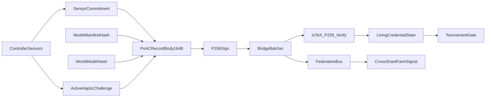

# VAPI Whitepaper V2 → V3 Novel Rewrite Map (Reviewer-Resistant + Gamer-Relevant)

This document is a **rewrite map**, not a replacement. It does **not** modify the existing whitepaper at `docs/vapi-whitepaper-v2.md`.

## 0) North-star: what VAPI is (precise, defensible)

**VAPI is a Human Physical Input Provenance (HPIP) primitive for gaming.**

- **Cryptographic guarantees (hard)**: a signed, ordered, replay-resistant evidence stream whose integrity can be verified by third parties on-chain (origin + ordering + non-repudiation under stated key custody assumptions).
- **Empirical guarantees (measured)**: layered detectors over a controller’s **physics-coupled** signals (IMU/sticks/triggers) plus (flagship) an **active haptic challenge-response** that software-only injection cannot satisfy because it cannot feel or respond to physical resistance.
- **Operational guarantees (governance)**: a living credential whose state can change based on longitudinal evidence, with explicit governance assumptions and compromise blast radius.

**Core V3 claim (single sentence):** VAPI makes *provenance* of controller input cryptographically verifiable, then makes *software-only forgery* empirically infeasible by binding that provenance to physics-coupled sensing and optional active haptic challenge-response.

## 1) Claim surgery list (what changes, why it survives review)

### A. “Cryptographically verify a human gaming session”
- **V2 phrasing (risk)**: “cryptographically verify that a gaming session was performed by a human physically operating a controller” (Abstract) and “physical human gaming sessions are cryptographically attested” (Abstract).
- **Why reviewers attack it**: signatures + hash-chaining prove *origin/integrity*, not “human” as a purely cryptographic statement. “Human-ness” depends on physical assumptions + empirical separations.
- **V3 replacement (strictly defensible)**:
  - **Cryptographic**: “cryptographically verifies origin, ordering, and integrity of a controller evidence stream produced by a registered device key.”
  - **Empirical/physical**: “provides a physics-backed attestation surface (passive coupling + optional active haptic challenge-response) that makes software-only injection inconsistent with the committed sensor evidence under stated threat assumptions.”
- **Where to reflect**: Title, Abstract, Introduction, Threat Model, Conclusion.

### B. “ZK proof proves honest execution of biometric pipeline”
- **V2 phrasing (risk)**: “proving honest execution of the biometric pipeline without revealing raw sensor features on-chain.”
- **What code currently supports**:
  - On-chain contract `contracts/contracts/PITLSessionRegistry.sol` explicitly warns that mock mode bypasses all ZK invariants (good).
  - **Critical implementation mismatch**: on-chain verification currently sets `pub[2] = 0` for `inferenceResult` and does not bind it to the proof inputs.
- **V3 replacement (strictly defensible)**:
  - “The session proof is a *privacy-preserving consistency proof* over a limited set of public commitments (feature commitment, humanity score bounds, nullifier/epoch anti-replay), and it does **not** (yet) prove end-to-end correctness from raw sensor data nor enforce inference code on-chain.”
  - If/when inference enforcement is desired, explicitly label it as a **follow-on implementation step**.
- **Where to reflect**: §ZK Session Proof, §Limitations, and the “Security Notice” box.

### C. “Without trusting any intermediary”
- **V2 phrasing (risk)**: “without trusting any intermediary.”
- **Why reviewers attack it**: the bridge is an intermediary (batching, submission timing, enforcement authority). The system reduces trust but does not eliminate it.
- **V3 replacement**:
  - “Does not require trusting a *single* intermediary for integrity: withholding is detectable via chain gaps; verification is public; but liveness, batching, and enforcement remain operationally mediated.”

### D. “Unforgeable biometric detection boundary”
- **V2 phrasing (risk)**: “unforgeable” can trigger “strongest-claim wins” scrutiny.
- **V3 replacement**:
  - “A high-cost-to-forge surface under explicit assumptions (no physical device compromise; adversary may control host software).”

### E. Privacy posture (location in every record)
- **V2 phrasing**: plaintext lat/long in frozen record format + “no confidentiality.”
- **V3 polish**:
  - Make privacy an explicit first-class trade-off.
  - Present **schema-based policy**: gaming deployments SHOULD default to location-disabled or coarse; DePIN deployments may require location.
  - Make “public-by-default on-chain data” explicit in the threat model.

## 2) Consistency checklist (must be true everywhere in V3)

### PoAC hashing/linkage semantics (V2 has contradictions across components)
You must choose one canonical meaning and align text to deployed verification:

- **On-chain verifier (`contracts/contracts/PoACVerifier.sol`)** stores chain head as:
  - `recordHash = sha256(raw_body_164B)` and enforces `prev_poac_hash == lastRecordHash`.
- **Whitepaper V2** states:
  - `record_hash = SHA-256(raw[:164])` is stored in `prev_poac_hash` of the next record (matches contract).
  - but also describes `chain_hash = SHA-256(raw[:228])` for on-chain indexing (does **not** match contract).
- **SDK (`sdk/vapi_sdk.py`)** currently documents and implements:
  - `prev_poac_hash` links to `SHA-256(full_228B)` (does **not** match contract/paper).

**V3 policy:** treat **SHA-256(body)** as the chain link and primary on-chain index, and treat any full-record hash as an optional *off-chain* convenience hash unless/until the contract changes.

**Follow-on code tasks (explicitly outside this rewrite):**
- Update `sdk/vapi_sdk.py` chain-link verification to match the canonical PoAC linkage (or update the protocol/contract if full-record linkage is intended).
- If full-record indexing is desired, add an explicit on-chain field/mapping/event to avoid ambiguous “indexing” language.

### ZK session proof semantics

Align the paper’s ZK claims to what is actually enforced on-chain.

- **What the contract enforces in real-verifier mode** (`contracts/contracts/PITLSessionRegistry.sol`):
  - It verifies a Groth16 proof against public signals:
    - `[0] featureCommitment`
    - `[1] humanityProbInt`
    - `[2] inferenceResult` **currently hard-coded to 0 in the contract**
    - `[3] nullifierHash`
    - `[4] epoch`
  - It enforces **nullifier anti-replay** even in mock mode.
- **What V3 must say (strict)**:
  - “The deployed on-chain session registry currently verifies a proof that binds the session to a nullifier/epoch and to bounded public scalar outputs. Inference enforcement is not currently bound on-chain.”
  - “Mock mode bypasses all ZK invariants; it is non-production.”
- **Follow-on code task (outside this rewrite)**:
  - Bind `inferenceResult` correctly (contract-side) or remove it from the claimed public-signal set (paper-side) so the proof story is coherent.

### Privacy + schema alignment
- **What exists on-chain now**: `contracts/contracts/PoACVerifier.sol` supports `verifyPoACWithSchema()` and persists `recordSchemas[recordHash]`.
- **V3 policy**:
  - Treat schema as an explicit *deployment policy lever*: gaming schema can mandate location-redacted, while DePIN schema can require location.
  - Avoid “one frozen format fits all” privacy posture; frozen *byte layout* can remain, but fields can be deployment-constrained.

## 3) Novelty pillars (each must tie to shipped artifacts)

Each pillar must be described as “what it is, what it guarantees, and what it does not.”

1. **PoAC as an evidence rail (cryptographic provenance)**  
   - PoAC is a fixed-size evidence record (hash commitments + monotonicity + signature) forming a verifiable chain.  
   - **Maps to**: `contracts/contracts/PoACVerifier.sol`, `controller/*` (record generation), `bridge/vapi_bridge/codec.py` (serialization).

2. **Physics-backed liveness via coupling (passive PITL)**  
   - The system uses signals software injection cannot satisfy *simultaneously* (IMU noise floor + coupling constraints).  
   - **Maps to**: `controller/hid_xinput_oracle.py`, `controller/l2b_imu_press_correlation.py`, `controller/l2c_stick_imu_correlation.py`, `controller/temporal_rhythm_oracle.py`, `controller/tinyml_biometric_fusion.py`.

3. **Active haptic challenge-response (the flagship differentiator)**  
   - VAPI can actively perturb the physical system (adaptive trigger resistance) and measure a biomechanical response.  
   - **Maps to**: `bridge/controller/l6_trigger_driver.py`, `bridge/vapi_bridge/l6_response_analyzer.py`, `bridge/controller/l6_challenge_profiles.py`.

4. **Living credential + longitudinal enforcement**  
   - “Proof” is a stateful credential that can be suspended/reinstated based on longitudinal evidence, not a one-time attestation.  
   - **Maps to**: `contracts/contracts/PHGCredential.sol`, `bridge/vapi_bridge/insight_synthesizer.py`, `contracts/contracts/TournamentGateV3.sol`.

5. **Federated bot-farm correlation (multi-instance scaling)**  
   - Cluster fingerprints can be cross-confirmed without sharing raw identifiers.  
   - **Maps to**: `bridge/vapi_bridge/federation_bus.py`, `contracts/contracts/FederatedThreatRegistry.sol`.

## 4) V2 → V3 section-by-section mapping

This is the practical rewrite map: what to keep, what to rewrite, what to move, and what to de-emphasize.

### Title
- **V2**: “Cryptographic Proof of Human Gaming via Hardware-Rooted Controller Input Attestation”
- **V3**: “Verifiable Human Input Provenance for Gaming (HPIP): A Cryptographic Evidence Rail with Physics-Backed Liveness and Active Haptic Challenge-Response”
- **Reason**: avoids overclaiming “cryptographic proof of human” while still being bold and novel.

### Abstract
- **Rewrite completely** into 3 parts:
  - **Provenance (crypto)**: what is verified, by whom, and what is *not* claimed.
  - **Physics (why software-only injection breaks)**: passive coupling + active challenge.
  - **Impact (all gamers)**: ranked fairness, remote qualifiers, streamer verification, dispute forensics.
- **Delete**: “without trusting any intermediary” phrasing.

### 1. Introduction
- **Keep**: “human-controller attestation problem”
- **Add**: “Impact for all gamers” subsection (Casual / Ranked / Esports / Creators / Accessibility & fairness).
- **Polish**: explicitly state the threat model includes a compromised host software stack.

### 2. Background / Related Work
- **Keep**: anti-cheat gap framing
- **Reorder**: put “remote attestation limitations” and “why physics helps” earlier.
- **Move**: most DePIN discussion to an appendix; keep only 1–2 paragraphs in main text as a portability demonstration.

### 3. System Model and Definitions
- **Keep**: formal definitions
- **Add**: an explicit “What is proven vs inferred” table.
- **Add**: an explicit “Trust boundary” diagram (device hardware, host, bridge, chain).

### 4. PoAC Protocol
- **Keep**: wire format table (good)
- **Rewrite**: hashing/linkage section to match deployed contract and avoid ambiguous “index hash” language.
- **Add**: canonical statement:
  - `prev_poac_hash := SHA-256(previous_body_164B)` (if that is the intended canonical)
  - `on_chain_record_id := SHA-256(this_body_164B)` (what `PoACVerifier` uses today)
  - “full-record hash” described as optional off-chain convenience.

### 5–7. Architecture / Implementation
- **Restructure** around novelty pillars rather than component inventory:
  - (A) Evidence rail (PoAC)  
  - (B) Passive physics coupling (PITL L2–L5)  
  - (C) Active haptic challenge-response (L6)  
  - (D) Living credential enforcement  
  - (E) Federation scaling
- **De-emphasize**: LLM “BridgeAgent” in the mainline novelty narrative; keep as an appendix capability so reviewers don’t conflate it with the security-critical pipeline.

### ZK PITL Session Proof
- **Rewrite as**: “What it guarantees / What it does not guarantee / Deployment modes (mock vs verified)”
- **Mandatory**: reflect the current on-chain binding gaps as “not yet enforced on-chain” rather than claiming it already is.

### 8. Evaluation
- **Split** into:
  - **Engineering correctness** (tests, invariants, chain integrity, gas costs)
  - **Empirical separation** (hardware baseline distributions, adversarial transforms)
  - **Active challenge** (L6 calibration status; list next measurement milestones)
- **Add**: “Reproducibility capsule” (scripts to run, dataset artifact locations, what is synthetic vs measured).

### 9. Security & Threat Model
- **Keep**: threat enumeration
- **Add**: attacker capability matrix: (host compromised / USB MITM / physical device compromise).
- **Make explicit**: what VAPI does not defend (physical key extraction, invasive hardware mods) and what that means for gamer deployments.

### 10. Limitations & Future Work
- **Move earlier**: put the biggest limitations *before* conclusion (so readers don’t accuse you of burying them).
- **Keep & tighten**: multi-person separation, L6 calibration, governance hardening.

### Conclusion
- **Rewrite** to restate the crisp theorem:
  - “verifiable provenance + physics-backed liveness + optional active challenge + living credential + federation.”

## 5) New figures/tables to add in V3 (high leverage)

- **Table: What VAPI proves vs infers**
  - proven: signature validity, ordering, replay resistance, chain integrity
  - inferred: human coupling probability, injection likelihood, farm correlation
- **Figure: Trust boundary / data flow**
- **Table: Gamer impact matrix**
  - casual / ranked / esports / creators / accessibility
- **Table: Adversary capability matrix**
  - host-only attacker vs bus-level MITM vs physical device compromise

## 6) One mermaid diagram (V3 core narrative)

## 7) Draft text blocks (ready to paste into V3)

### Abstract: the replacement “hard claim”
“VAPI provides a cryptographically verifiable provenance rail for controller input: each session yields a signed, hash-chained evidence stream that any third party can verify on-chain. VAPI then makes software-only forgery empirically infeasible under stated assumptions by binding evidence to physics-coupled sensing and (optionally) an active haptic challenge-response. Rather than claiming a purely cryptographic proof of ‘human’, VAPI composes verifiable provenance with measurable physical constraints, enabling high-trust ranked queues, remote tournament qualification, and dispute-resilient gameplay verification across all gamer segments.”

### ZK proof: “what it is” sentence
“The PITL session proof is a privacy-preserving consistency proof over public commitments and anti-replay nullifiers; it is not yet an end-to-end proof that raw sensor streams were transformed into features correctly.”

## 8) Follow-on alignment tasks (code-level, explicitly outside this rewrite)

These are the minimum “paper ↔ implementation” alignment tasks surfaced by the rewrite. They should be tracked as engineering follow-ups, not hidden by wording.

- **PoAC linkage in SDK**: align `sdk/vapi_sdk.py` chain-link semantics with the deployed `PoACVerifier` linkage (body hash vs full-record hash).
- **PoAC indexing language**: either (a) adjust all documentation to state the on-chain index is `SHA-256(body)` only, or (b) add an explicit on-chain full-record index if you want to keep “full-record hash indexing” as a claimed property.
- **PITL ZK public-signal binding**: bind `inferenceResult` on-chain (and ensure verifier input order matches the circuit), or remove/relax “inference enforced by proof” claims everywhere.
- **Mock mode posture**: ensure all docs/UX clearly label mock/open mode as non-production, including any dashboards.
- **Privacy policy enforcement**: if gaming deployments should be location-redacted, enforce that at verification boundaries (schema + verifier policies) rather than relying on “social defaults.”

